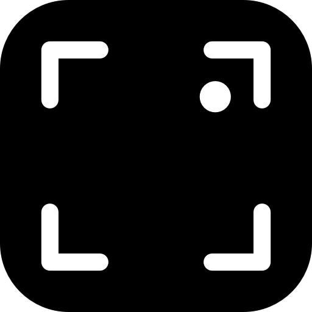

# TinySnapper

[](https://opensource.org/licenses/MIT)
[](https://www.apple.com/macos/)
[](https://swift.org)

TinySnapper is a small native macOS menu bar app for capturing screenshots and copying a styled version to the clipboard.



> Working in this repo with Claude Code, Codex, OpenClaw, or another coding agent? Start with [AGENTS.md](AGENTS.md).

## Features

- 📸 **Quick Screenshot Capture** — Capture screenshots directly from the menu bar
- 🎨 **Styled Output** — Copy beautifully styled screenshots to clipboard
- 📋 **Clipboard Integration** — Open images directly from clipboard or file
- ⌨️ **Keyboard Shortcuts** — Fast capture with Cmd+Ctrl+2 and Shift+Cmd+2
- 🚀 **Launch at Login** — Optional auto-start with macOS
- 💾 **PNG Export** — Save screenshots locally

## Requirements

- macOS 13.0 or later
- Apple Silicon or Intel Mac
- Xcode Command Line Tools or Xcode with Swift 6 support

## Installation

### Install on the current Mac

Build and install the app on the current Mac:

```sh
./scripts/install-app.sh
```

Install the login agent too:

```sh
./scripts/install-login-agent.sh
```

### Permissions

TinySnapper needs macOS Screen Recording permission to capture screenshots.

- macOS prompts for this the first time you try a capture flow.
- If macOS asks you to quit and reopen TinySnapper, do that before testing again.
- This permission cannot be pre-approved by script on another Mac.

## Install on another Mac

Create a portable zip from this repo:

```sh
./scripts/package-for-another-mac.sh
```

That produces:

```text
dist/TinySnapper-another-mac.zip
```

On the other Mac:

1. Copy `dist/TinySnapper-another-mac.zip` to that machine.
2. Unzip it.
3. Run `TinySnapper-portable/install-tinysnapper.sh`.
4. Open TinySnapper from `/Applications/TinySnapper.app` if it does not launch automatically.
5. Run `Capture and Copy Styled` once.
6. When macOS asks for Screen Recording, click `Allow`.
7. If macOS asks you to quit and reopen TinySnapper, do that and test again.

Notes:

- Screen Recording permission cannot be pre-approved by script on another Mac.
- The packaged app uses the stable bundle identifier `com.andreprado.tinysnapper.local`, which helps macOS keep permissions attached to the correct app identity.

## Release

For a signed public release, use the production bundle identifier:

```text
com.andreprado.tinysnapper
```

Use `.local` only for local/dev installs. Once you ship publicly, keep the production bundle identifier stable so macOS permissions and app identity remain consistent across updates.

Set these before running the release script:

```sh
export TINYSNAPPER_BUNDLE_ID="com.andreprado.tinysnapper"
export TINYSNAPPER_VERSION="1.0.0"
export TINYSNAPPER_BUILD_NUMBER="1"
export TINYSNAPPER_CODESIGN_IDENTITY="Developer ID Application: Your Name (TEAMID)"
export TINYSNAPPER_NOTARY_PROFILE="tinysnapper-notary"
```

Optional:

```sh
export TINYSNAPPER_ARCHS="arm64 x86_64"
```

That produces a universal app when your machine has a toolchain that supports multi-architecture Swift builds. The default release path is `arm64`.

Run:

```sh
./scripts/release-app.sh
```

Artifacts:

```text
dist/TinySnapper.app
dist/release/TinySnapper-<version>-mac.zip
```

Before shipping, verify:

1. The version and build number are correct.
2. The bundle identifier is `com.andreprado.tinysnapper`.
3. Signing and notarization are configured on your Mac.
4. `./scripts/release-app.sh` completes successfully.
5. The app works on a clean Mac or clean user account.
6. Capture, copy styled, import, save, and launch-at-login all work.
7. The first-run Screen Recording approval flow behaves correctly.

### Local/dev defaults

For local packaging, the defaults remain:

- `TINYSNAPPER_BUNDLE_ID=com.andreprado.tinysnapper.local`
- `TINYSNAPPER_VERSION=0.1.0`
- `TINYSNAPPER_BUILD_NUMBER=1`
- `TINYSNAPPER_CODESIGN_IDENTITY=-`

## Development

### Build and run

```sh
# SwiftPM debug build
swift build

# Build the app bundle in dist/
./scripts/build-app.sh

# Install locally for testing
./scripts/install-app.sh

# Start the installed app
./scripts/run-tinysnapper.sh start
```

Helpful commands:

| Task | Command |
|------|---------|
| Build only | `./scripts/build-app.sh` |
| Build + install | `./scripts/install-app.sh` |
| Install launch agent | `./scripts/install-login-agent.sh` |
| Package for another Mac | `./scripts/package-for-another-mac.sh` |
| Clean build artifacts | `rm -rf .build/ dist/ /tmp/tinysnapper-build-app` |
| Start app | `./scripts/run-tinysnapper.sh start` |
| Restart app | `./scripts/run-tinysnapper.sh restart` |
| Stop app | `./scripts/run-tinysnapper.sh stop` |

### Troubleshooting

If you move or rename the repository and `swift build` starts failing with module cache or `SwiftShims` errors, clear the local build artifacts and rebuild:

```sh
rm -rf .build
swift build
```

### Project Structure

```
├── Sources/TinySnapper/    # Swift source code
│   ├── Editor/             # Screenshot editor UI (WKWebView + Canvas)
│   ├── Models/             # Data models (EditorState, Annotations)
│   ├── Services/           # Business logic (Capture, Export, Hotkeys)
│   ├── Support/            # Utilities and extensions
│   └── Resources/          # Web assets (canvas.js, canvas.css)
├── scripts/                # Build and install scripts
├── Package.swift           # Swift Package Manager manifest
└── README.md               # This file
```

## Contributing

Contributions are welcome. Please see [CONTRIBUTING.md](CONTRIBUTING.md) for guidelines.

The project does not currently include automated tests, so local smoke-testing of the app bundle and core flows is especially important.

- 🐛 [Report bugs](https://github.com/andreprado/tinysnapper/issues)
- ✨ [Request features](https://github.com/andreprado/tinysnapper/issues)
- 🔧 [Submit pull requests](https://github.com/andreprado/tinysnapper/pulls)

## License

TinySnapper is licensed under the [MIT License](LICENSE).

## Acknowledgments

- Built with Swift and AppKit
- Inspired by the need for quick, beautiful screenshots

